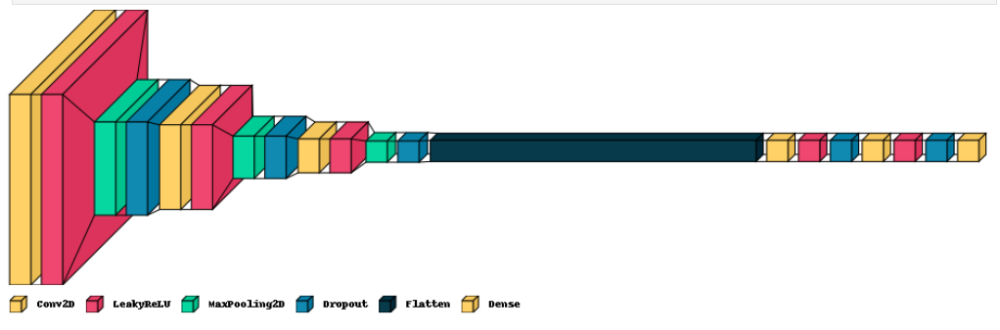
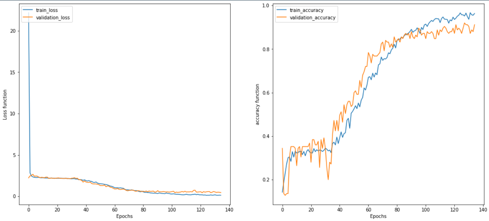
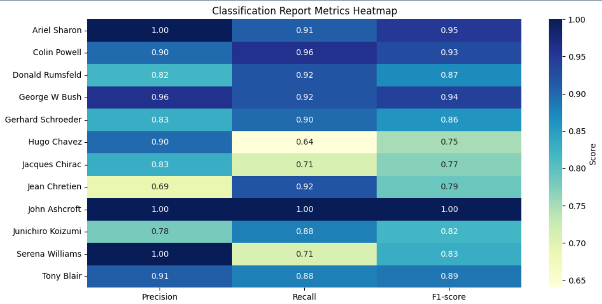
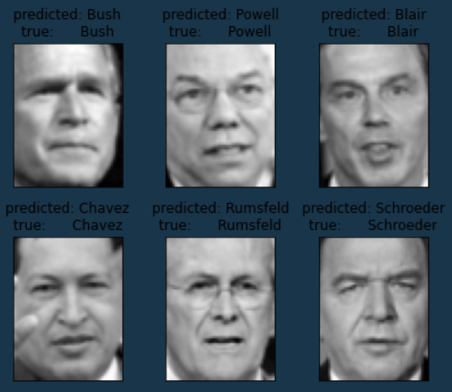

# Face Recognition Using CNN on LFW Dataset

This repository contains a Convolutional Neural Network (CNN) model built from scratch for **face recognition** using the [Labeled Faces in the Wild (LFW)](https://scikit-learn.org/stable/modules/generated/sklearn.datasets.fetch_lfw_people.html) dataset. The model is trained to classify faces of celebrities with at least 50 samples per person.

---

## Dataset

We use the **LFW (Labeled Faces in the Wild)** dataset provided by `sklearn.datasets.fetch_lfw_people`.  
- Only individuals with **at least 50 images** are included.  
- Each image is grayscale with dimensions `(62, 47)` pixels.

---

## Model Architecture

The CNN model consists of the following layers:

* **3 Convolutional layers** with increasing filter sizes (32, 64, 128)
* LeakyReLU activations (alpha=0.1)
* MaxPooling layers after each convolution
* Dropout layers to reduce overfitting
* Flatten layer to convert 2D feature maps to 1D vector
* Dense fully connected layers with LeakyReLU activations
* Final Dense layer with `softmax` activation for classification

---

## Training

* The model is trained with **categorical cross-entropy loss** and **Adam optimizer**.
* Input images are reshaped to `(62, 47, 1)` grayscale format.
* Labels are one-hot encoded for multi-class classification.

---

## Results & Visualizations

### Training and Validation Loss & Accuracy

### Classification Report Metrics Heatmap

### Sample Predictions

---

## Dependencies

* Python 3.x
* TensorFlow / Keras
* scikit-learn
* numpy
* matplotlib
* seaborn
* pandas

---

## Usage

1. Load the dataset and preprocess images and labels.
2. Build the CNN model as defined.
3. Train the model using your training split.
4. Evaluate model performance on validation/test data.
5. Visualize results using matplotlib and seaborn.
